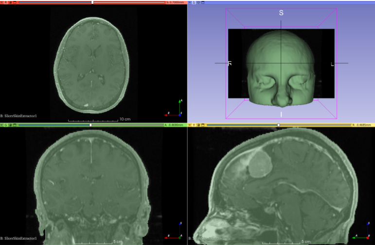

# Skin surface extraction

This repository contains the code for a Slicer module that can be used to automatically extract the skin surface on different brain imaging modalities (CT, MR) and different sequences (T1, T2, FLAIR, etc).

This is a project for the [36th NA-MIC Project Week](https://projectweek.na-mic.org/PW36_2022_Virtual/Projects/SkinSegmentation/).

## Installation

### Option 1
Clone this repository:

```shell
git clone https://github.com/ReubenDo/SlicerSkinExtractor.git
```

### Option 2

[Download the zipped directory](https://github.com/ReubenDo/SlicerSkinExtractor/archive/refs/heads/main.zip) and unzip it.

### Add directory in Slicer

In Slicer, go to `Edit -> Application Settings -> Modules` and add the cloned/downloaded folder to the `Additional module paths`. When prompted, restart Slicer.

## Algorithm description



TODO
